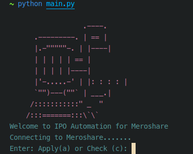

# Automating Meroshare

## Usage

#### 1. Clone Repo

```shell
git clone https://github.com/VoidArchive/meroshare-automate.git
cd meroshare-automate
```

#### 2. Create a Virtual Environment

```shell
python3 -m venv venv
source venv/bin/activate
```

#### 3. Install Requirements

```shell
pip install -r requirements.txt
```

#### 4. Download Selenium Web driver

- [Selenium driver](https://www.selenium.dev/documentation/webdriver/) of your browser version.

#### 5. Put the web driver path in meroshare.py

```python

options = webdriver.ChromeOptions()
# Any chromium browser executable path
options.binary_location = r'/usr/bin/brave-browser'
options.add_argument("--incognito")
# Here >>
self.browser = webdriver.Chrome(
	executable_path=r'YOURPATH/chromedriver', options=options)
```

#### 6. Make your data/data.json file

Your can add all your account details here, make sure not to share it.

```json
[
  {
    "Name": "Your name",
    "DP": "GLOBAL IME CAPITAL LIMITED (11200)",
    "Username": "123456",
    "Password": "Your password",
    "CRN": "00000000",
    "BOID": "0000000000000000000",
    "PIN": "0000"
  },

  {
    "Name": "Your name",
    "DP": "GLOBAL IME CAPITAL LIMITED (11200)",
    "Username": "123456",
    "Password": "Your password",
    "CRN": "00000000",
    "BOID": "0000000000000000000",
    "PIN": "0000"
  }
]
```

#### 7. Run main.py file

```shell
python main.py
```



- Enter a to apply for share or c to check.

#### Important!

In main.py line number 38, you can change the row number.

```python
print(meroshare.get_result(offer_row=0))

```

And,
You can comment line number 60 if you're sure all account have same row structure, bonus or right share are provided.

```python
# Comment this line if you're sure all account have same row structure, bonus or right share are provided.
row = int(input("Enter the row no: "))
meroshare.get_offering(offer_row=row)

```
